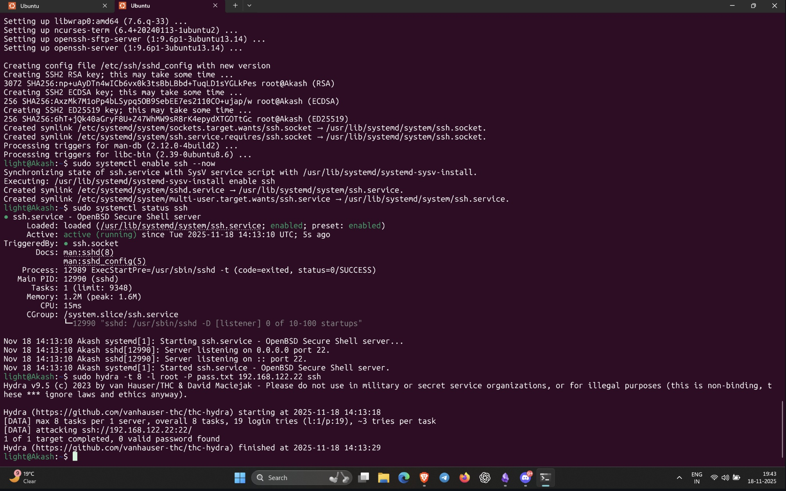
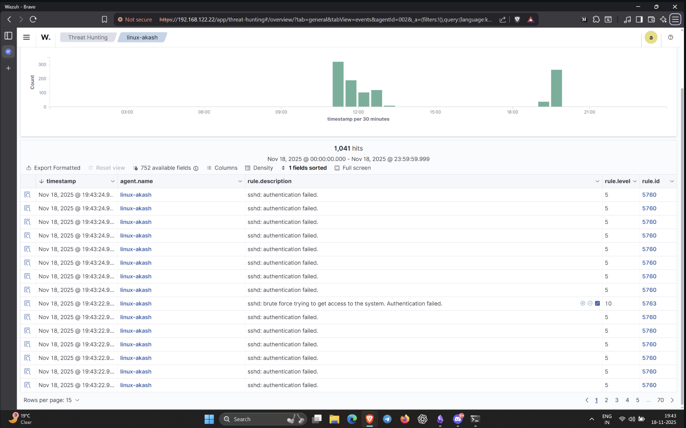

## **1. Preparing the Environment**

For this lab, I used my Ubuntu machine running the Wazuh agent.  
SSH logging is done through:

`/var/log/auth.log`

So I made sure Wazuh was already collecting that file (it usually is by default).

If needed, the entry is:

`<localfile>   <log_format>syslog</log_format>   <location>/var/log/auth.log</location> </localfile>`

Then restarted the agent:

`sudo systemctl restart wazuh-agent`

---

## **2. Generating SSH Login Failures**

To simulate a brute-force attack, I tried logging into my own machine with wrong passwords.

### Manual failed logins

I used:

`ssh akash@<my-ip>`

Then purposely entered incorrect passwords multiple times.

Each failed attempt creates logs like:

`Failed password for invalid user from X.X.X.X`

---

## **3. Performing a Brute-Force Attack (High-Volume)**

For a more realistic brute-force scenario, I used `hydra`:

`hydra -l root -P /usr/share/wordlists/rockyou.txt ssh://<my-ip>`

This sends fast, repeated password attempts, which are perfect for triggering Wazuh alerts.

---

## **4. What Happened in Wazuh**

Inside **Threat Hunting → Events**, Wazuh began showing multiple alerts related to SSH failures. Some of the alerts I observed:

- _SSHD authentication failed_
    
- _Multiple SSH authentication failures_
    
- _sshd: reverse mapping checking failed_
    
- _Brute force attack detected_
    
- _Possible authentication attack from source IP_
    

These came from built-in Wazuh rules under:

`rule.groups: sshd`

and

`rule.groups: authentication_failed`

Once the number of failed attempts crossed a threshold, Wazuh automatically raised higher-level alerts.

---

## **5. Logs That Triggered Alerts**

SSH logs in `/var/log/auth.log` contain lines like:

`Failed password for root from 192.168.x.x port 52014 ssh2 Connection closed by authenticating user root 192.168.x.x port 52014 Received disconnect from 192.168.x.x: 3: Authentication failed Error: maximum authentication attempts exceeded`

Wazuh parses these logs using its built-in ruleset.

---

## **6. What I Learned**

- Wazuh can detect SSH brute-force attacks **without any extra modules**.
    
- All detection comes from analyzing `/var/log/auth.log`.
    
- Failed passwords, repeated failures, and suspicious patterns automatically generate alerts.
    
- Tools like Hydra make it easy to test SSH brute-force detection.
    
- Real brute-force attempts generate clear, readable alerts inside Wazuh Threat Hunting.
 

 

 

 

