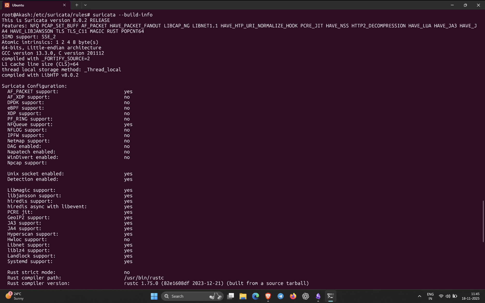
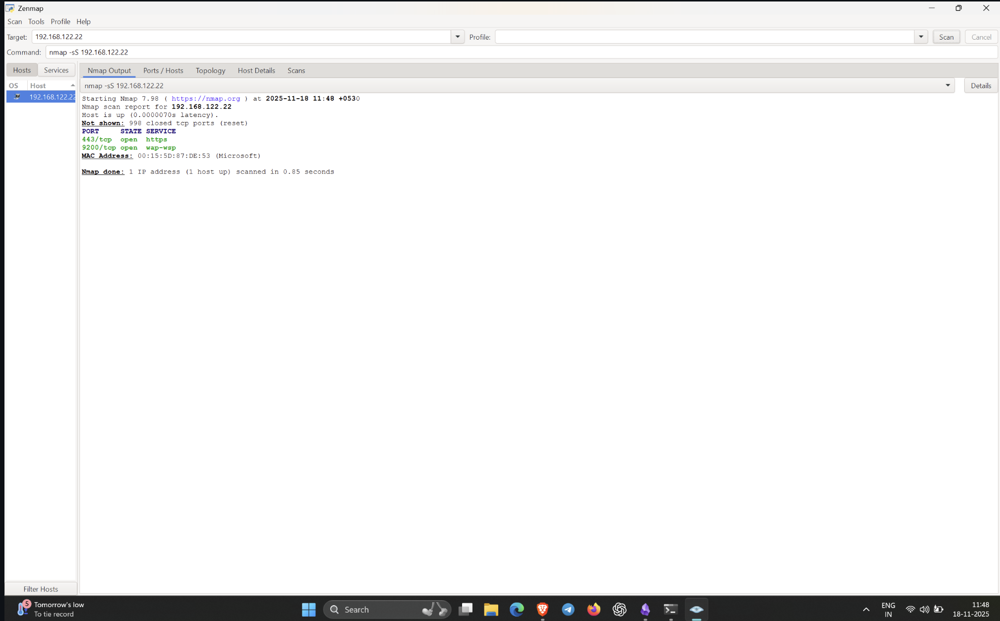
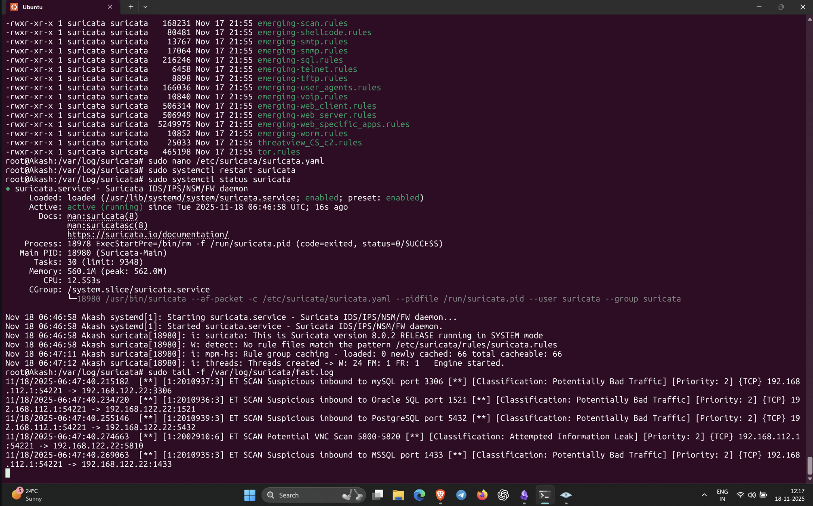
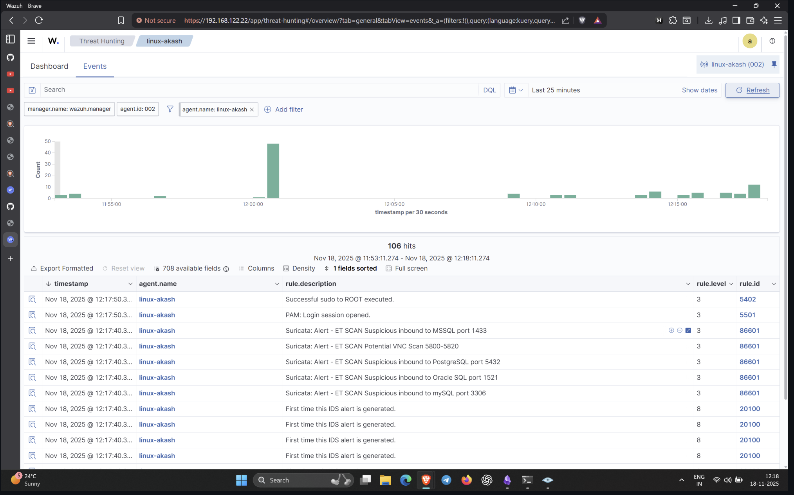

#  Suricata IDS Lab (My Notes)

## **1. Installing Suricata**

First, I installed Suricata on my Ubuntu system:

```bash
sudo add-apt-repository ppa:oisf/suricata-stable
sudo apt-get update
sudo apt-get install suricata -y
```

After installation, I confirmed the binary:

```bash
suricata --version
```

---

## **2. Downloading Emerging Threats Ruleset**

Suricata doesn’t come with detection rules by default, so I downloaded the **ET Open rules**:

```bash
cd /tmp && curl -LO https://rules.emergingthreats.net/open/suricata-6.0.8/emerging.rules.tar.gz
sudo tar -xzf emerging.rules.tar.gz
sudo mv rules /etc/suricata/
sudo chmod 640 /etc/suricata/rules/*.rules
```

Initially, the rules were not loading because of **permission denied errors**, so I fixed it later (explained below).

---

## **3. Checking Network Interface**

My instructor used `enp1s0`, but mine was different.  
I checked my interface using:

```bash
ifconfig
```

For my lab, the primary interface was:

```
eth0
```

So in Suricata’s config, I set:

```yaml
af-packet:
  - interface: eth0
```

---

## **4. Updating suricata.yaml**

I modified `/etc/suricata/suricata.yaml`:

### ✔ Rule paths

```yaml
default-rule-path: /etc/suricata/rules

rule-files:
  - suricata.rules
  - "*.rules"
```

### ✔ Home network address

```yaml
HOME_NET: "192.168.122.22"
EXTERNAL_NET: "any"
```

### ✔ Stats

```yaml
stats:
  enabled: yes
```

Saved the file.

---

## **5. Fixing Rule Permission Errors**

At first Suricata wasn’t detecting anything.  
Logs showed:

```
permission denied: /etc/suricata/rules/*.rules
0 signatures processed
```

I fixed it by giving Suricata ownership:

```bash
sudo chown -R suricata:suricata /etc/suricata/rules
sudo chmod -R 755 /etc/suricata/rules
```

After this, Suricata successfully loaded thousands of signatures.

---

## **6. Restarting Suricata**

Every time I changed the config, I restarted:

```bash
sudo systemctl restart suricata
sudo systemctl status suricata
```

I made sure to see:

```
signatures processed: XXXX
```

This confirmed rules were actually loaded.

---

## **7. Verifying Logs**

Suricata writes logs here:

- `/var/log/suricata/eve.json`
    
- `/var/log/suricata/fast.log`
    
- `/var/log/suricata/stats.log`
    

To watch alerts live:

```bash
sudo tail -f /var/log/suricata/eve.json | grep alert
sudo tail -f /var/log/suricata/fast.log
```

Initially `fast.log` was empty because Suricata wasn’t loading rules.  
After fixing permissions, it started filling with alerts.

---

## **8. Integrating Suricata with Wazuh**

To send Suricata alerts into Wazuh, I added this inside `ossec.conf`:

```xml
<localfile>
  <log_format>json</log_format>
  <location>/var/log/suricata/eve.json</location>
</localfile>

<localfile>
  <log_format>syslog</log_format>
  <location>/var/log/suricata/fast.log</location>
</localfile>
```

Restarted the Wazuh agent:

```bash
sudo systemctl restart wazuh-agent
```

Now Wazuh Threat Hunting could display Suricata alerts.

---

## **9. Testing the IDS (Simulated Attacks)**

I triggered active attacks from another machine (my Windows PC):

### ✔ Nmap port scan

```bash
nmap -sS 192.168.122.22
```

### ✔ Aggressive scan

```bash
nmap -A -T4 192.168.122.22
```

Once Suricata was fixed, alerts started appearing:

- **ET SCAN Nmap Scripting Engine**
    
- **ET SCAN Potential SYN Scan**
    
- **ET POLICY Suspicious Traffic**
    
- **ET MALWARE User-Agent detections**
    

Logs showed them in both:

- `/var/log/suricata/fast.log`
    
- `/var/log/suricata/eve.json`
    
- And also in **Wazuh > Threat Hunting > Events**
    

---

## **10. Summary of What I Learned**

- Suricata must load rules or it won't detect anything.
    
- Permissions matter — Suricata could not access rules because the rules directory belonged to root.
    
- Wazuh cannot show Suricata alerts unless logs are added to `ossec.conf`.
    
- Network interface names differ across systems (`eth0`, `enp0s3`, etc.).
    
- Suricata logs are very detailed — `eve.json` especially.
    
- IDS detection works instantly once everything is configured correctly.
    







