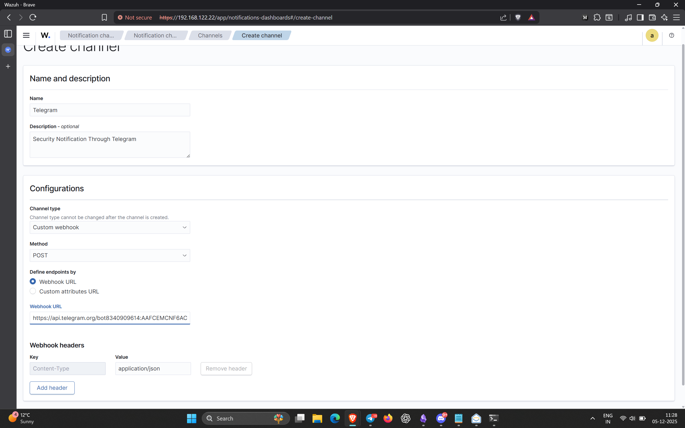
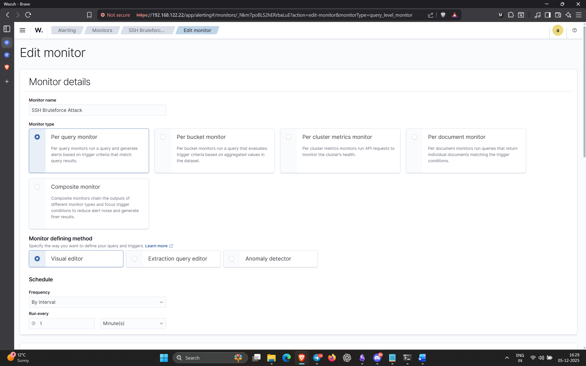
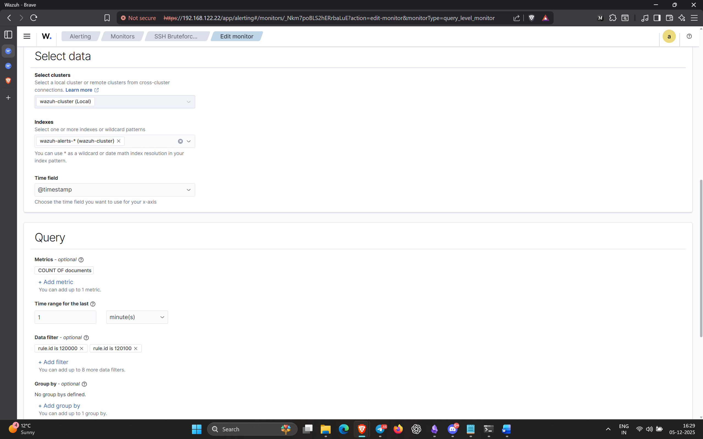
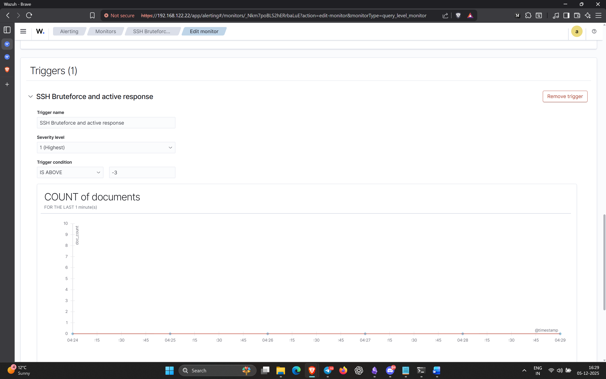
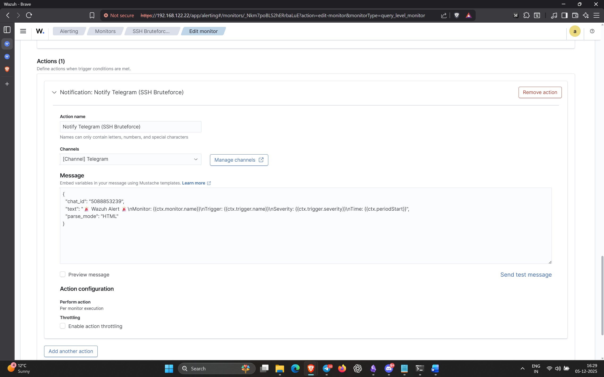
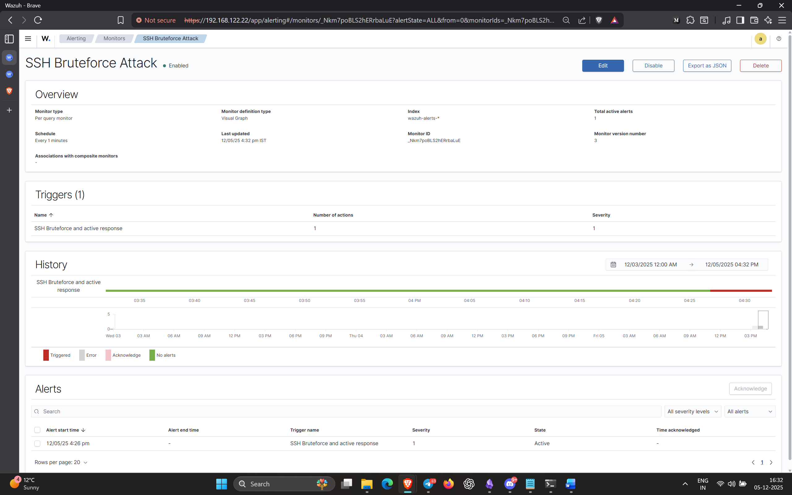
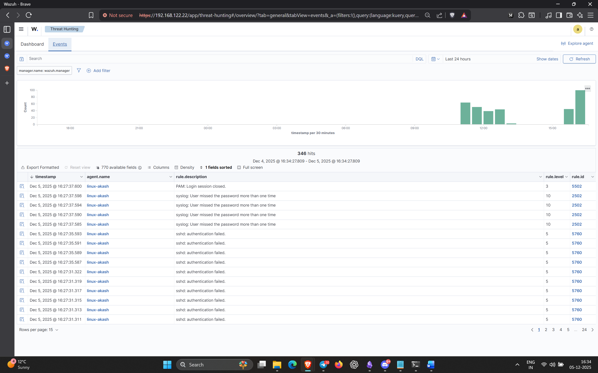

---

# **Detecting SSH Brute-Force Attacks & Sending Alerts to Telegram Using Wazuh**

This project demonstrates how I built an end-to-end detection pipeline for SSH brute-force attacks using **Wazuh**, enriched it with **custom correlation rules**, and automated real-time alerting through **Telegram** using Wazuh’s native alerting engine.

The goal of the project was to simulate a realistic brute-force attack, detect malicious authentication behavior through Wazuh’s SIEM capabilities, and forward high-fidelity alerts directly to Telegram for rapid incident response.

---

##  **Environment Setup**

The setup involved a **Wazuh Manager** and a **Wazuh Agent**, both running on **Ubuntu Linux**.  
SSH logs from the agent were already being collected from:

```
/var/log/auth.log
```

Wazuh’s default syslog decoder and SSH rule groups (`sshd`, `authentication_failed`) were used as the base for detection.

---

##  **Telegram Bot Integration for Alerting**

To enable real-time notifications, I integrated Telegram with Wazuh alerting:

- Created a bot through **BotFather** and obtained the API token.
    
- Retrieved the chat ID using:
    

```
https://api.telegram.org/bot<API-TOKEN>/getUpdates
```

- Configured a new **notification channel** in Wazuh and added the Telegram webhook URL:
    

```
https://api.telegram.org/bot<API-TOKEN>/sendMessage
```

This allowed Wazuh to send alerts directly to my Telegram account whenever a brute-force detection rule was triggered.

---

## **Building Custom SSH Brute-Force Detection Rules**

Wazuh has strong built-in SSH detection, but I wanted **more accurate correlation** and **MITRE-mapped alerts**, so I created two local rules.

These were added to:

```
/var/ossec/etc/rules/local_rules.xml
```

### **Password Guessing Rule (ID: 120100)**

This rule monitors repeated PAM authentication failures.

```
<group name="pam_syslog,">
  <rule id="120100" level="10" frequency="3" timeframe="120">
    <if_matched_sid>5503</if_matched_sid>
    <description>Possible Password guessing attack for $(dstuser)</description>
    <mitre>
      <id>T1110</id>
    </mitre>
  </rule>
</group>
```

### **SSH Brute-Force Correlation Rule (ID: 120000)**

This rule correlates multiple SSH anomalies from the same source IP.

```
<group name="bruteforce_correlation">
  <rule id="120000" level="12" frequency="3" timeframe="120">
    <if_matched_sid>5763</if_matched_sid>
    <if_matched_sid>5503</if_matched_sid>
    <if_matched_sid>5760</if_matched_sid>
    <if_matched_sid>5710</if_matched_sid>

    <same_srcip />

    <description>Correlated bruteforce: any of (5763,5503,5760,5710)</description>
    <group>bruteforce_correlation</group>
  </rule>
</group>
```

These rules allowed Wazuh to move from **simple event logging** to **intelligent behavior-based detection**, combining multiple log types into one high-confidence brute-force alert.

---

##  **Creating the Alert Monitor in Wazuh**

To forward only relevant brute-force alerts, I used Wazuh’s **alerting → monitors** feature.

Although the documentation recommends a _per-document_ monitor, it caused indexing issues. After extensive troubleshooting, I switched to **per-query monitor**, which worked perfectly.

The monitor used:

- **Index:**
    
    ```
    wazuh-alerts-*
    ```
    
    This ensures all alerts—regardless of source—are included.
    
- **Query Filters:**
    
    - `rule.id = 120000` (SSH brute-force correlation)
        
    - `rule.id = 120100` (password guessing detection)
        
- **Notification Action:**  
    Custom message template sent to Telegram through the channel created earlier.
    

Example of data I included in the alert message:

- Attacker IP
    
- Target user
    
- Rule triggered
    
- Severity level
    
- Timestamp
    

---

##  **Simulating the Attack**

To generate high-volume SSH failures, I used **Hydra**, a widely used password-cracking tool.

```
hydra -l root -P /usr/share/wordlists/rockyou.txt ssh://<target-ip>
```

This produced rapid authentication failures, filling `/var/log/auth.log` with lines such as:

```
Failed password for root from <IP>
```

Wazuh detected these events instantly and escalated them through the custom correlation logic.

---

##  **Final Result: Real-Time Telegram Alerting**

As soon as the correlated brute-force rule triggered, Wazuh sent structured alerts directly to my Telegram bot.

This provided:

- Immediate visibility
    
- Enrichment with rule details
    
- MITRE mapping
    
- Attacker information
    
- Source IP and affected user
    

The alerting pipeline worked flawlessly end-to-end.

---

##  **What This Project Demonstrates**

This project showcases my ability to:

- Build **real-world attack simulations**
    
- Analyze Linux authentication logs
    
- Customize **Wazuh SIEM rules** for better detection
    
- Correlate multi-step attack patterns
    
- Configure **alert pipelines** using webhooks
    
- Integrate security monitoring with **Telegram automation**
    
- Troubleshoot SIEM indexing and monitoring issues
    
- Produce operational incident alerts for SOC workflows

## **Screenshots**

## Channel


## Monitor


## Edit Monitor


## Triggers


## Notification on Telegram


## Whole Monitor


## Telegram OP
 

## Events



