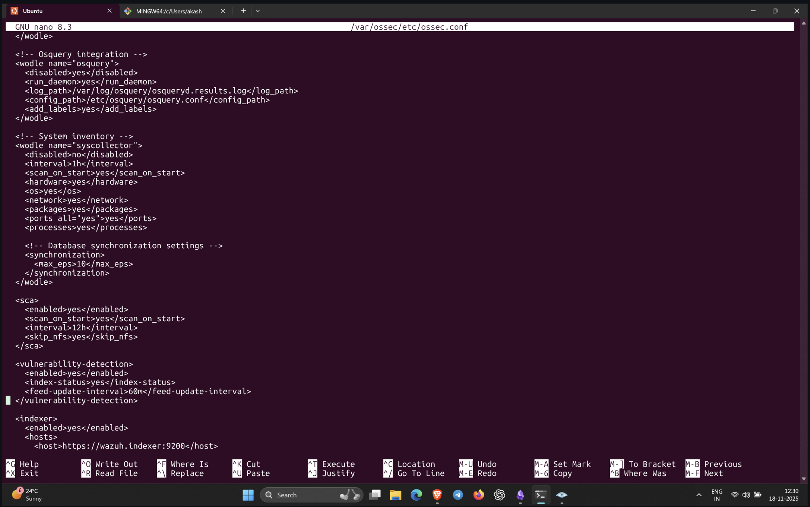
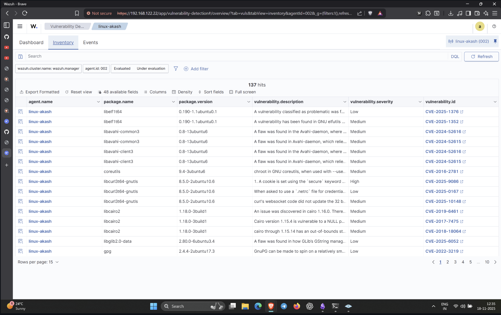

# Vulnerability Detection Lab — Notes

## **1. Editing the Manager Configuration**

The vulnerability detector only works on the **Wazuh Manager**, not the agent.  
So I entered the manager container:

```bash
sudo docker ps
sudo docker exec -it <manager_container_id> bash
```

Inside the container:

```bash
nano /var/ossec/etc/ossec.conf
```

## **2. Enabling Vulnerability Detector**

Inside `ossec.conf`, I added/enabled:

```xml
<vulnerability-detector>
  <enabled>yes</enabled>
  <interval>1h</interval>
  <run_on_start>yes</run_on_start>

  <provider name="canonical">
    <enabled>yes</enabled>
    <os>ubuntu</os>
  </provider>

  <provider name="nvd">
    <enabled>yes</enabled>
  </provider>
</vulnerability-detector>
```

This enables the NVD and Canonical feeds for Ubuntu vulnerability scanning.

## **3. Restarting the Wazuh Manager**

Still inside the container:

```bash
/var/ossec/bin/ossec-control restart
```

This reloads all configs.

(Alternatively from host: `sudo docker restart <id>`)

## **4. Checking Detection Results**

After a few minutes, I went to:

**Wazuh Dashboard → Modules → Vulnerability Detection**

There I could see:

- Detected CVEs
    
- Severity (Critical/High/Medium)
    
- Affected packages
    
- Version info
    
- CVE descriptions






