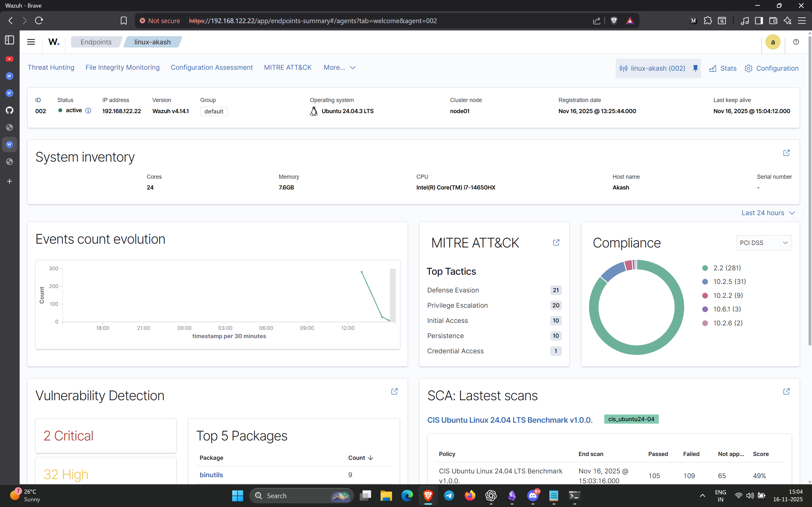
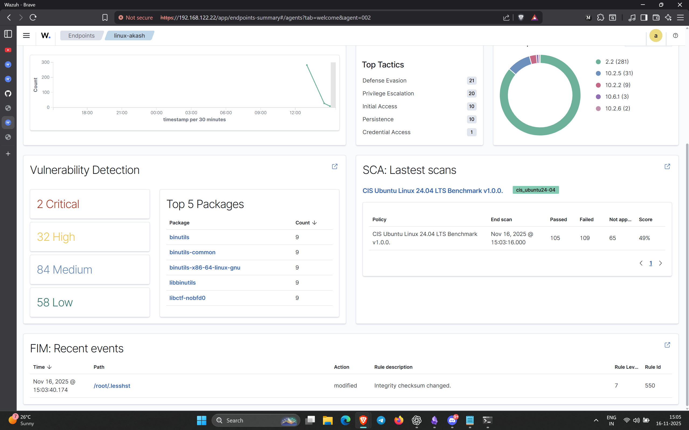
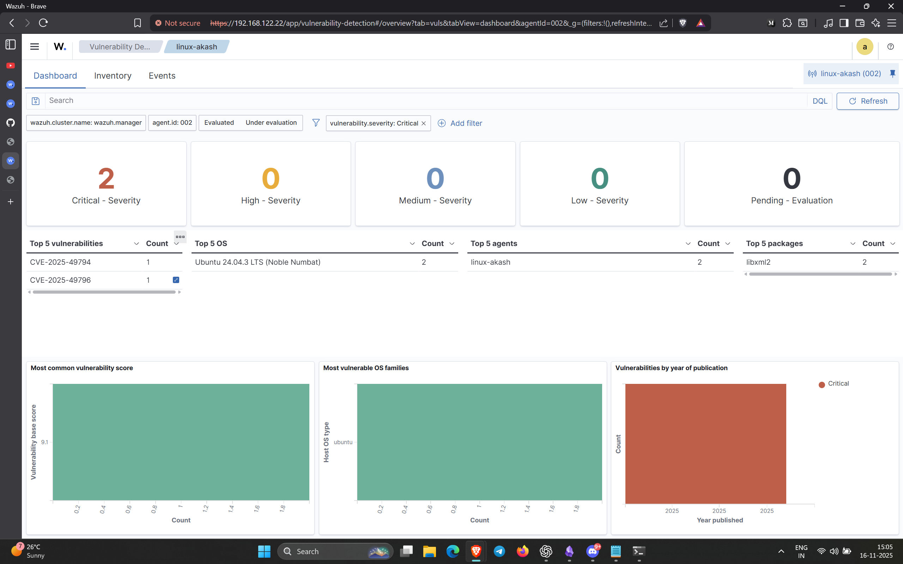
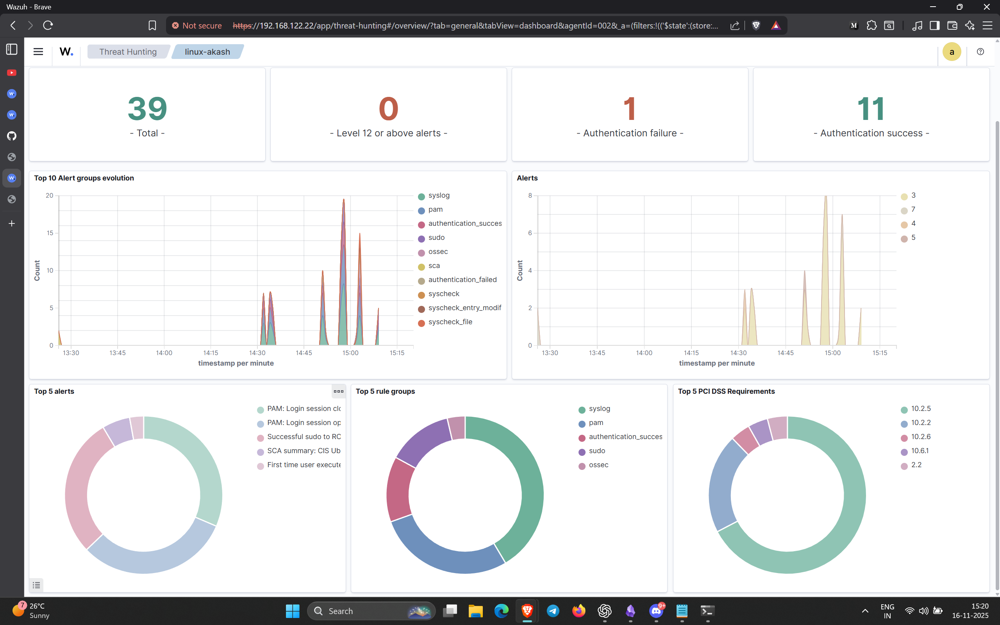
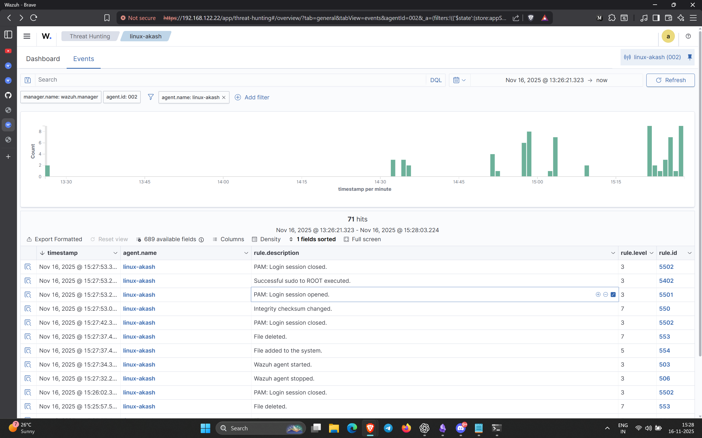
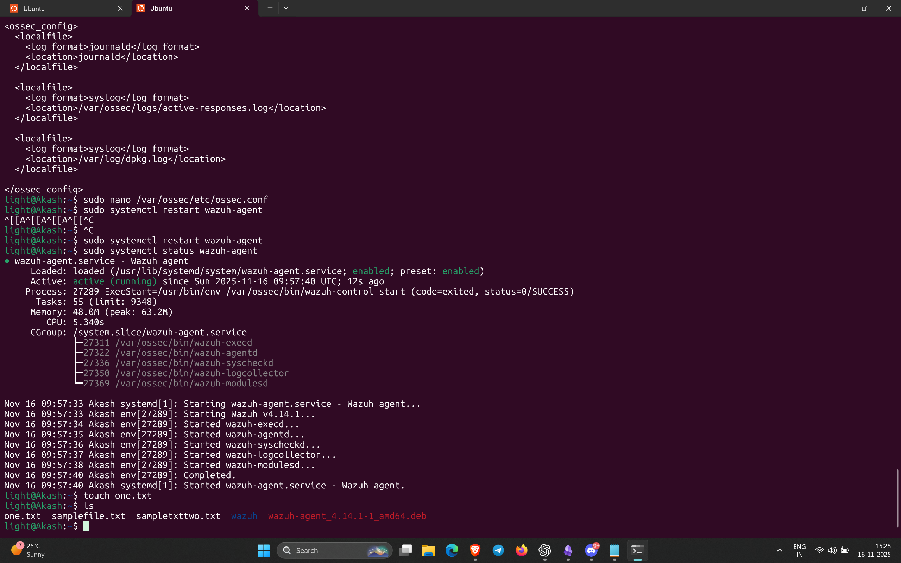
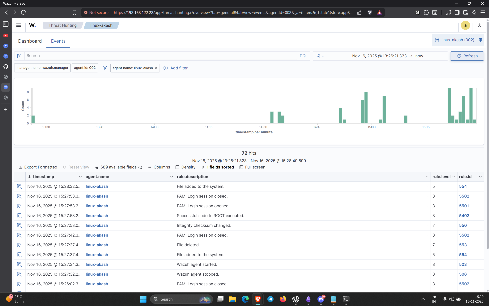
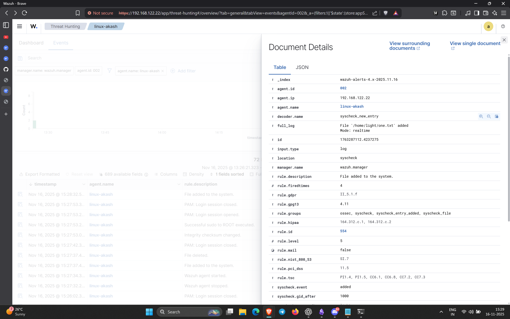

### **1. Setting up Wazuh (Manager + Dashboard)**

- Started by pulling the official Wazuh Docker stack.
    
- Ran:
    
    `docker compose up -d`
    
- This brought up:
    
    - Wazuh Manager
        
    - Wazuh Indexer
        
    - Wazuh Dashboard
        
- Verified with:
    
    `sudo docker ps`
    
- Initially couldn’t enter the container using normal `docker exec` because my local user didn’t have Docker permissions → fixed it by using `sudo`.
    

### **2. Accessing the Manager Container**

- Opened manager shell using:
    
    `sudo docker exec -it <manager-container> bash`
    
- The prompt looked like `bash-5.2#` instead of the instructor’s because my container image was **Amazon Linux 2023**, not Ubuntu.
    
- Package manager was missing (`apt` not found), so I installed nano using:
    
    `dnf install -y nano`
    
    (Amazon Linux uses `dnf`, not `apt`).
    

### **3. Installing the Agent on My Ubuntu Machine**

- Downloaded the agent `.deb` package:
    
    `curl -s -O https://packages.wazuh.com/4.x/apt/wazuh-agent-4.14.1-1_amd64.deb`
    
- Installed via:
    
    `sudo dpkg -i wazuh-agent-4.14.1-1_amd64.deb`
    
- Initially, `/var/ossec/` didn’t exist → realized the agent service wasn’t started yet.
    
- Started it:
    
    `sudo systemctl start wazuh-agent sudo systemctl enable wazuh-agent`
    
- Registered the agent:
    
    `sudo /var/ossec/bin/agent-auth -m <manager-ip>`
    
- After that, the agent started appearing on Wazuh Dashboard.
    

---

# **4. Editing Agent Syscheck (FIM) Settings**

By default, syscheck only monitors system directories like `/etc`, `/usr/bin`, `/root`.

So file creation in `/tmp` or `/home` did NOT show up.

### I added FIM monitoring for the directories I wanted:

Edited:

`sudo nano /var/ossec/etc/ossec.conf`

Added inside `<syscheck>`:

`<directories check_all="yes" report_changes="yes" realtime="yes">/tmp</directories> <directories check_all="yes" report_changes="yes" realtime="yes">/home</directories>`

Restarted agent:

`sudo systemctl restart wazuh-agent`

---

# **6. Testing File Integrity Monitoring**

Then I tested file create/modify/delete actions:

`echo "hello" > /tmp/testfile.txt echo "updated" >> /tmp/testfile.txt rm /tmp/testfile.txt`
### What showed up in Wazuh:

- **File added to the system** (rule ID 554)
    

# 📸 **Screenshots / Evidence**

## **1. Wazuh Dashboard**

---

## **2. Wazuh Dashboard (Second View)**

---

## **3. Agent Dashboard (Agent Registered)**

---

## **4. Alerts Page**

---

## **5. Events Page (Threat Hunting)**

---

## **6. Terminal — Commands Executed**

---

## **7. Event Showing File Added**

---

## **8. Rules and Event Details**
